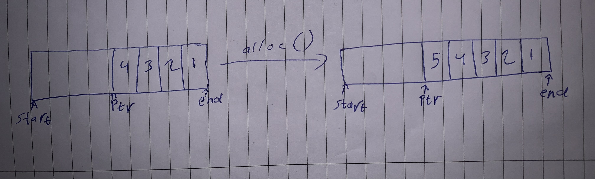

- [Intro](#intro)
- [How to use](#how-to-use)
  - [as a standalone project](#as-a-standalone-project)
  - [as a submodule](#as-a-submodule)
- [Task 1](#task-1)
  - [Mechanisim](#mechanisim)
  - [constructor](#constructor)
  - [allocation](#allocation)
    - [Usage](#usage)
    - [alignement](#alignement)
      - [Example](#example)
  - [Deallocation](#deallocation)
    - [Usage](#usage-1)
- [task 2](#task-2)
  - [extra macros and data structures](#extra-macros-and-data-structures)
  - [Tests](#tests)
- [Task 3](#task-3)
  - [Bump Down](#bump-down)
    - [optimizations](#optimizations)
      - [temporary pointers](#temporary-pointers)
      - [alignment](#alignment)
  - [Benchmarking](#benchmarking)
    - [Library](#library)
      - [usage](#usage)
    - [Benchmark tests](#benchmark-tests)
      - [`test_up_small` and `test_down_small`](#test-up-small-and-test-down-small)
      - [`test_up_big` and `test_down_big`](#test-up-big-and-test-down-big)
      - [`new_alignment` and `old_alignment`](#new-alignment-and-old-alignment)
      - [`test_dealloc` and `test_destructor`](#test-dealloc-and-test-destructor)
      - [os and cpu info](#os-and-cpu-info)

# Intro

Bump allocation is a simple memory allocation strategy where memory is allocated by moving a pointer, or "bump," along a pre-allocated memory region. This method is efficient for short-lived objects and stack-based memory management, as it requires minimal bookkeeping and overhead. Its straightforward approach accelerates memory allocation and deallocation, making it suitable for scenarios where quick and temporary memory assignments are prevalent, ensuring a streamlined and expedited memory management process.

# How to use

## as a standalone project

first you need to clone the repository locally with the following command:

```bash
$ git clone --recurse-submodules https://gitlab.uwe.ac.uk/y2-abuhummos/worksheet-2.git
$ cd worksheet-2
```

next, you can run the unit tests using the following commands:

```bash
$ clang++ -I./include -std=c++17 -o unit unit_tests.cpp include/simpletest/simpletest.cpp
$ ./unit
```

and the benchmarks:

```bash
$ clang++ -I./include -O3 -std=c++17 -o bench benchmarks.cpp
$ ./bench
```

## as a submodule

you can also use the library as a submodule in your project by following the below steps:

```bash
$ git submodule add https://gitlab.uwe.ac.uk/y2-abuhummos/worksheet-2.git
$ export CPLUS_INCLUDE_PATH="${CPLUS_INCLUDE_PATH:+${CPLUS_INCLUDE_PATH}:}<path/to/include>"
```

and then your `cpp` or `hpp` files:

```cpp
#include <allocators/balloc.hpp>
#include <allocators/r_balloc.hpp>
#include <bencmark.hpp>
```

# Task 1

Bump allocation is a fast, but limited approach to allocation. We have a chunk of memory, and we maintain a pointer within that memory. Whenever we allocate an object, we do a quick check that we have enough capacity left in our chunk to allocate the object and then update the pointer by the object’s size. That’s it!

The disadvantage of bump allocation is that there is no general way to deallocate individual objects or reclaim the memory region for a no-longer-in-use object.

These trade offs make bump allocation well-suited for phase-oriented allocations. That is, a group of objects that will all be allocated during the same program phase, used, and then can all be deallocated together as a group.

## Mechanisim

The allocator is defined as a template with a non-type argument that specifies the size of bytes it owns.

## constructor

Once created, it allocates memory with the template parameter, and sets start and end pointers for bounds, and sets the next pointer equall to the start one.

## allocation

the allocating method is also templated and takes in the type for the requested data type, which is used to return a pointer to it at the end, and also used to figure out the alignement on if needed

### Usage

```cpp
BumpUp<8 * sizeof(int)> bumper;
int *x = bumper.alloc<int>(3);
int *y = bumper.alloc<int>(3);
int *z = bumper.alloc<int>(3); // will return nullptr
```

### alignement

A CPU finds it more efficient to avoid crossing block borders when reading data such as an integer. Therefore, an alignment of 4 implies that data of this type should commence at an address that is divisible by 4.

```
memory byte    0 1 2 3      4 5 6 7      8 9 10 11
integer        goooood
                   baaaaaaaaadd
```

[reference for the above demonstration](https://stackoverflow.com/a/11386991)

Thus to align the pointer to the size of the specified type, we originally used the following modulo operation:

```cpp
if (unsigned long remainder = ((unsigned long)esp % alignof(T))) {
    new_ptr += alignof(T) - remainder;
}
```

what it does is calculate the remainder of the current pointer and then inverse that value and move the pointer by that much. but since alignment is always a multiple of 2, when taken to the binary level, that means we are only clearing the lowest bits of the address, to do that we use the following:

```cpp
(ptr - 1u + alignment) & -alignment;
```

[reference for the above line](https://stackoverflow.com/a/67834958)

which calculates the 2's complement of the alignment value (which is clearing the lowest bits and leaving the rest) and then using a bitwise AND to clear the unaligned bits from the address. it also adds alignment-1 to the pointer to invert the remainder of it.

#### Example

original address: `75` (`0100 1011`)

alignment: `4` (`0000 0100`)

Adjust Address for Alignment:
Subtract 1 from the original address and add the alignment (4 in this case):

```
Original Address:         0100 1011
Subtract 1:             - 0000 0001
                        -----------
Intermediate Result:      0100 1010 (adjusted address)
Add Alignment (4):      + 0000 0100
                        -----------
Adjusted Address:         0100 1110
```

Bitwise AND with Negation of Alignment:
Negate the 4-bit alignment (in two's complement form):

```
Negation of Alignment:   1111 1100
Bitwise AND:             0100 1110
                       & 1111 1100
                       -------------
Result:                  0100 1100
```

the final result is `76` which is divisible by `4`

## Deallocation

When deallocating happens, the approach is resetting the bump pointer to the initial position of the pre-allocated memory chunk. This rapid mass deallocation method, however, bypasses the invocation of `free` on the allocated objects. Despite its efficiency in freeing up memory quickly, it is essential to consider the potential implications on resource management and cleanup procedures within the context of bump allocation.

### Usage

```cpp
BumpUp<8 * sizeof(int)> bumper;
int *x = bumper.alloc<int>(3);
int *y = bumper.alloc<int>(3);
int *z = bumper.alloc<int>(3); // will return nullptr
bumper.dealloc();
bumper.dealloc();
// you can also use bumper.force_dealloc();
z = bumper.alloc<int>(3); // works
```

# task 2

in this section i will explain the reasoning behind each unit test. There is 16 unit tests in total, 8 for each implemntation, so here we will explain 8 since the other 8 are exactly the same but with the bump down

## extra macros and data structures

- `is_aligned`: takes in a pointer and the alignment size and checks if the pointer is aligned. [reference for the macro](https://stackoverflow.com/a/1898487)

- `MyClass`, `MyStruct`, `MyUnion` and `MyEnum`: abritary data structures that are used in the tests to be allocated and test their different alignments

## Tests

- **Test 1**: used to check that the allocator will return `nullptr` when its full

- **Test 2**: check if the dealloc function works after the allocator has been filled up

- **Test 3**: aims to test that alignement works by missaligning it with `char`s and then follow it with a different data type that needs alignment. this one uses the `is_aligned` macro to check if the pointer returned is aligned

- **Test 4**: try to allocate data that doesnt have space and will return `nullptr` then try to allocate something smaller in size and should allocate for it

- **Test 5**: Allocate different custom data types and try to access their fields after allocation. it uses the types created at the top, which are classes, structs, unions and enums

- **Test 6**: check if custom data structures will be aligned correctly, since their size is different from their alignment, unlike literal data types

- **Test 7**: test multiple allocations and deallocations back to back, and also check the number of allocations is correct after deallocations

- **Test 8**: allocate a specific amount of bytes, and then check if it fits this size exactly

# Task 3

## Bump Down

This implemntation is very similar to the Bump Up one, except that the pointer to memory starts from the end, and walks down until the start, the main reason for that is that when allocating, there is no need to keep track of an extra pointer, in addition to the elimination of inverting the remainder for the alignment, as will be seen in the next section.

### optimizations

#### temporary pointers

the bump up allocation requires a pointer to keep track of the current address to be returned, while the memory pointer moves forward. In the bump down there is no need for that as we are already at the high address and then move down to the start address as can be seen below:

**Bump up**


**Bump down**



#### alignment

```cpp
new_ptr & -alignof(T)
```

as we can see, there is no longer a need to invert the remainder foe the alignment, which is 2 less instructions than the bump up

## Benchmarking

### Library

There is a provided benchmarking library that gets initialized with the number of iterations and has a `benchmark` method which takes in a test name and function with its parameters and also has a print method that prints the results and fast/slow are all the other benchs compared to the first as a baseline

#### usage

```cpp
#include "benchmark.h"

void do_smth(int x) {}

int func() {
    return 42;
}

int main() {
    Benchmark b(500);
    b.benchmark("test 1", do_smth, 5);
    b.benchmark("test 2", func);
    b.benchmark("test 3", func);
    b.benchmark("test 4", func);
    b.print();
}

```

output format (numbers will be different):

```txt
Name           Result (ms)    Relative (%)
test 1         0.00124881     0.00000000
test 2         0.00121219     2.93207133
test 3         0.00121848     2.42855198
test 4         0.00122352     2.02512792
```

### Benchmark tests

the below results are for different benchmark tests, and they have all been run 5000 times and the average of that was taken. the tests aim to check different aspects of the allocator like object size, alignment and freeing.


#### `test_up_small` and `test_down_small`

this test is for creating a number of unaligned literal objects multiple times, and the bump down is **22.7%** faster, which is not much, but that is due to how small the data is.

#### `test_up_big` and `test_down_big`

this one is about creating big objects, for example here we are using a struct with 4 `double`s in it. and this benchmark has a more noticable difference being **22.1%** faster

#### `new_alignment` and `old_alignment`

this benchmark is more focused on the lower level details of the implemntation, and tests the alignment with the modulo operation and the alignment with bit shifting. the output shows that the bit shifting is faster by **6%**, so not only does it save memory, its also faster

#### `test_dealloc` and `test_destructor`

this test is about whether to create a new bumper over and over or just use the dealloc method which will simply resit the pointer to the start (or end depending on which implemntation) of the allocator. the ouput says that it is **3%** faster, but it is suspected to go way heigher due to the number of `new` calls increasing as its a costly operator compared to copying a pointer

#### os and cpu info


